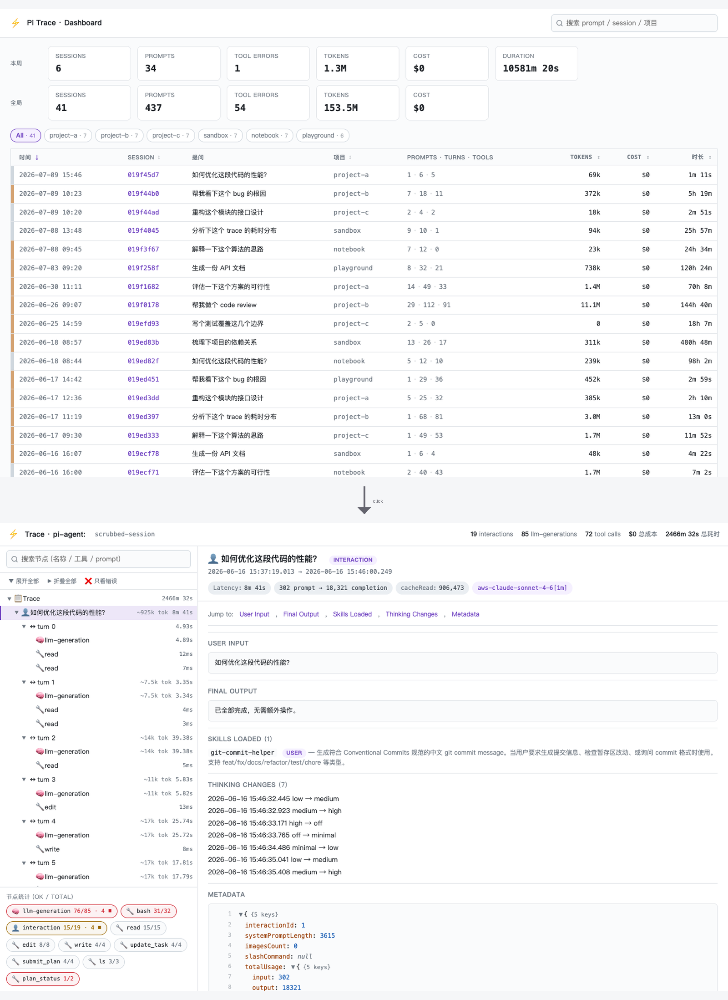

### 实验性：pi-agent 的 Langfuse 风格本地 trace 查看器

[](./LICENSE)
[](https://pi.dev/packages)
[](#不做的事情)
[](#不做的事情)
[](https://github.com/npxcnency-ux/pi-trace-extension)

* * *

**pi-trace-extension 把 pi-agent 的 session 从"对话视角"重组成"执行视角"。** pi 自带的 `session.jsonl` 是按消息组织的——可回放但扁平。本扩展订阅 pi 的生命周期事件，按 *agent 实际怎么一步步推进* 重建成一棵树——每次 LLM 调用、每次工具执行、每个子 agent，连同耗时、token 成本、状态——边发生边写到磁盘。

每个 session 输出两份产物：

- **`events.jsonl`** — 机器可读，追加写入的事件流
- **`trace.html`** — 自包含、单文件、Langfuse 风格的查看器（零外部资源，任何浏览器打开都能看）

数据全程留在本机。



| pi 自带的 `session.jsonl` | pi-trace-extension |
| --- | --- |
| 对话视角（按消息顺序） | 执行视角（step + 工具 + 子 agent 组成的树） |
| 一份产物 | 两份产物：`events.jsonl`（机器）+ `trace.html`（人） |
| 每条消息的元信息 | 每个 step 的耗时、token、成本、stop reason、完整 LLM payload |
| 工具调用作为 inline 消息 | 工具作为 `llm-generation` 的兄弟节点挂在 `turn` 下（Langfuse 风格） |
| 无状态语义 | `aborted` / `error` / `ok` 三态区分并配色 |
| 子 agent 折叠成一个工具结果 | 子 agent 有自己的嵌套 trace（turn / step / tool），父 trace 一键跳转 |

> English docs: [README.md](./README.md)

* * *

## 安装

```bash
# 从 npm 装（推荐）
pi install npm:pi-trace-extension

# 或从 GitHub 装
pi install git:github.com/npxcnency-ux/pi-trace-extension

# 或不入库试用一次（仅本次 pi 进程）
pi -e npm:pi-trace-extension
```

不需要你指定安装目录。pi 会自动放到 `~/.pi/agent/npm/pi-trace-extension/`，每次启动自动加载。和任何其他 pi 扩展可以共存。

* * *

## 用法

正常使用 pi 即可——事件会在后台持续写入磁盘：

```
~/.pi/agent/traces/<session-id>/events.jsonl
```

随时渲染报告：

```
/trace
```

产物：

| 文件 | 说明 |
| --- | --- |
| `~/.pi/agent/traces/<session-id>/trace.html` | 单文件查看器，浏览器自动打开 |
| `~/.pi/agent/traces/<session-id>/events.jsonl` | 机器可读的事件流（追加写入） |
| `~/.pi/agent/traces/<session-id>/subagents/<child-id>/` | 子 agent 独立目录，结构同上，父 trace 节点上有跳转按钮 |

`session_shutdown` 时也会自动跑一次（不开浏览器），所以正常退出 pi 后随时可以回看。

手动渲染任意历史 session：

```bash
python3 ~/.pi/agent/npm/pi-trace-extension/extensions/trace/trace_to_html.py [session-name]
# 不传参数则渲染最新一个
```

**跨会话 dashboard** —— 磁盘上所有 session 的顶层索引。

在 pi 会话里输入：

```
/trace all
```

或从 shell：

```bash
python3 ~/.pi/agent/npm/pi-trace-extension/extensions/trace/trace_to_html.py --dashboard
# 输出到 ~/.pi/agent/traces/index.html
```

Dashboard 包含：本周 + 全局的 KPI 卡片（sessions / cost / duration）；可搜索/可排序的表格（时间、session id、首个提问、项目、规模、tokens、成本、时长），每行左侧一根状态色条（绿 = ok、黄 = aborted、红 = 有错误）；顶部有项目名 chip 用于快速筛选。点击 session id → 跳到该会话的 `trace.html`。

* * *

## 流水线

```
pi 运行时
  │  发出生命周期事件：
  │    session_start / interaction_start / turn_start
  │    before_provider_request  （完整 payload：model + messages + tools schema）
  │    message_end
  │    tool_execution_start / tool_execution_end
  ▼
extensions/trace/index.ts
  │  捕获、脱敏（关键字段名打码）、截断（单字符串 8 KB）
  └─ JSONL 落盘 → ~/.pi/agent/traces/<session-id>/events.jsonl
                                          │
   /trace 命令（或 session_shutdown）       │
  ────────────────────────────────────────┘
  │  spawn python3 extensions/trace/trace_to_html.py
  │    读 events.jsonl
  │    重建树：
  │      session → interaction → turn → llm-generation + tool
  │      子 agent 的 result 节点带跳转链接；
  │      子 agent 自己的 events.jsonl 也独立渲染出一份 trace.html
  │    把 viewer/assets.json（css + js + html）注入到一个文件
  └─ 写出 trace.html → 浏览器打开
```

数据模型刻意做得跟 Langfuse 相近，方便日后升级到托管后端时心智迁移。

* * *

## trace.html 里能看到什么

仿 Langfuse 的三栏布局。**单 HTML 文件，无 CDN，无外部字体，无 analytics。**

| 区域 | 内容 |
| --- | --- |
| **顶栏** | session ID（点击复制）、interactions / generations / tool calls 计数、总成本与总耗时 |
| **左栏树** | 层级：`session → interaction → turn → llm-generation + tool`（一个 turn 内 step 和 tool 同级）。点任意节点查看详情。搜索框按节点名 / 工具名 / prompt 过滤。 |
| **右栏详情** | 选中节点的：徽章（耗时 / token in→out / 成本 / 模型 / stop reason），分节内容 — Input（完整 LLM 请求 payload，带行号 JSON 折叠树）、Output、Tool Calls、Error/Aborted（区分配色）、Metadata。 |
| **左下 DAG 统计** | 按工具/节点类型分组：`bash 76/80 · 3 ⏹`（成功/总数 · 中断数）。有错误时红色边框，有中断时黄色边框。 |

具体能力：

- **`aborted` / `error` / `ok` 三态** — 用户取消（`⏹` 黄）vs 真错误（`❌` 红）vs 正常。pi 撞 429 自动 retry 后最终成功的，整体仍计为 `ok`，不会被中间失败误判。
- **「只看错误」过滤** — 树工具栏一个 toggle，勾选后只保留 `error` / `aborted` 节点及其从根到叶的完整祖先路径，长 session 一次点击聚焦失败分支。与文本搜索框叠加（AND）。无错误 session 里按钮禁用。
- **子 agent 有独立 trace** — 派生子 agent（single / parallel / chain）时，子进程把自己的 `events.jsonl` 写到 `subagents/<child-id>/`，并独立生成一份 `trace.html`。父 trace 的子 agent 节点会内联展示子 agent 的 turn / step / tool（从 messages 重建），并提供「Open child trace」跳转按钮。parallel 模式下尽量按 sessionId 匹配父子关系。
- **Retry 检测** — 同一个 `turnIndex` 在一个 interaction 内出现第二次（比如 429 后框架重试），节点名会标记成 `turn N (retry #1)`，不会被折叠成同一个 turn。
- **完整 LLM input payload** — `model`、所有 `messages[]` 条目（含 `reasoning_content`、`tool_calls`、`tool_result`）、注册过的 `tools[]` schema、请求级参数（max_tokens、temperature 等）。超长字符串截断到 8 KB，截断长度会显示出来。
- **跨进程容错** — 重启 pi 或 fork session 时，重复的 `stepIndex` / `turnIndex` 通过内部 `epoch` 计数器正确区分，不会渲染出"两个 turn 0"。

* * *

## 适合谁用

**适合：**

- 经常用 pi-agent，想**看清 LLM 实际收到了什么、做了什么**——一步一步还原
- 在调 prompt、工具定义、子 agent 协作、长会话上下文压缩
- 工作环境**要求 trace 数据不出本机**（个人电脑、不能上 SaaS 的合规场景）
- 不想为了看每轮 token 用量 / 成本 / 缓存命中率付钱给托管方

**不适合：**

- 想做**生产监控**：告警、多租户聚合、长期保留 — 选 Langfuse / LangSmith / Phoenix 自建版
- 想做**团队共享 dashboard** — 本扩展是单人单机用的
- 想 trace **不跑在 pi-agent 上的链路** — 本扩展只消费 pi 的事件流

* * *

## 不做的事情

分三类——分别意味着不同的应对。

**故意不做（明确选择，不是欠缺）**

- **没有网络代码。** 不上传匿名使用数据，不上传崩溃报告，没有"为了改进产品"的 telemetry。需要这些的话请 fork。
- **不自动脱敏 prompt。** 写盘前只对**字段名**做正则脱敏（`password` / `token` / `secret` / `api_key` / `authorization` / `bearer` → `***REDACTED***`）。你的原始 prompt、工具参数、工具输出、模型回复都是原文存储的。
- **没有团队共享 UI。** 单人单机。需要团队共享时，自建 Langfuse 是天然下一步——本扩展的数据模型刻意跟 Langfuse 对齐了。
- **没有内置归档/轮转。** 单 session 的 `events.jsonl` 只增不减。深度长会话可能涨到几十 MB；生成的 `trace.html` 超过 5 MB 时浏览器打开会慢。

**结构性的（写代码也修不了）**

- **`/trace` 需要 Python 3.8+。** 渲染器是 Python 标准库脚本——故意的：没有 Node 端构建步骤，没有 bundler。如果你的环境里没法装 Python，这个扩展不适合你。
- **绑定 pi 事件流。** 别的 agent 框架要用，得自己写一份采集层。

**隐私上限**

- **trace 数据默认就是敏感的。** prompt、工具参数、模型输出都可能含没匹配上正则的 PII / 密钥。要分享 `trace.html` 之前，**先人工过一遍。**

* * *

## 对比托管方案

本扩展刻意覆盖比成熟厂商小得多的范围。如实对比：

| | pi-trace-extension | Langfuse Cloud | LangSmith | Arize Phoenix |
| --- | --- | --- | --- | --- |
| 部署方式 | 本地文件 | SaaS 或自建 | SaaS only | SaaS 或本地 notebook |
| 数据是否离开本机 | 否 | 是 | 是 | 可配 |
| 需要账号 | 否 | 是 | 是 | 云端版需要 |
| 成本 | 免费、MIT | 免费档 + 付费 | 付费 | 免费 OSS |
| 多人 dashboard | 否 | 是 | 是 | 是 |
| 告警 / SLO | 否 | 是（付费） | 是 | 是 |
| 跨 session 聚合 | 本地 dashboard（`--dashboard`） | 是 | 是 | 是 |
| pi-agent 原生支持 | 是 | 可适配 | 否 | 可适配 |
| 看到第一张图的时间 | 几秒 | 几分钟（注册） | 几分钟 | 几分钟 |

它们不是竞争关系——解决的是不同问题。

* * *

## 运行依赖

- [pi-agent](https://pi.dev) ≥ 0.79.x
- Node ≥ 18（扩展运行时）
- Python ≥ 3.8（渲染器；如 python3 不在标准路径，可 `PI_TRACE_PYTHON=/path/to/python3` 覆盖）

无其他依赖。渲染器只用 Python 标准库；viewer 不引任何 JS 框架。

* * *

## 文件结构

```
pi-trace-extension/
├── README.md / README.zh.md / LICENSE / package.json
├── examples/
│   └── dashboard.png
└── extensions/
    └── trace/
        ├── index.ts            # pi 扩展入口（事件采集、/trace 命令）
        ├── trace_to_html.py    # 渲染器（events.jsonl → trace.html）
        └── viewer/
            ├── assets.json     # 打包后的 css + js + html（运行时加载，仓库提交）
            ├── viewer.css      # 源（单会话查看器）
            ├── viewer.html
            ├── viewer.js
            ├── dashboard.css   # 源（跨会话 dashboard）
            ├── dashboard.html
            ├── dashboard.js
            └── build.py        # 修改源后重新打包 assets.json
```

* * *

## FAQ 与常见问题排查

**启动时看到两条 `[pi-trace] extension loaded`。** 另一份扩展也被加载了（比如之前手动拷贝过到 `~/.pi/agent/extensions/trace/`）。把旧的从 `~/.pi/agent/extensions/` 移走——pi 会自动加载该目录下任何 `*/index.ts`。

**`/trace` 报 `python3: command not found`。** 装 Python 3.8+，或用环境变量指向解释器：
```bash
export PI_TRACE_PYTHON=/opt/homebrew/bin/python3
```

**浏览器没自动打开。** 路径会显示在通知里，手动打开即可。底层用的命令：macOS `open`、Linux `xdg-open`、Windows `start`。

**`events.jsonl` 太大 / `trace.html` 加载慢。** 单字符串截断到 8 KB，但跨多天的深度 session 仍可能涨。目前还没自动归档——需要时新开一个 session。

**想分享 trace 但里面有敏感内容。** 内置脱敏只覆盖了"敏感字段名"。需要打开 `trace.html`，搜索敏感子串，手动改 HTML 后再分享。CLI 脱敏工具在[路线图](#路线图)上。

* * *

## 开发

改 UI 前先读 [docs/design-language.md](./docs/design-language.md)——里面沉淀了视觉语法、信息密度取舍、明确不做的方向。PR 评审可按 `§N.M` 引用具体条款。

```bash
git clone https://github.com/npxcnency-ux/pi-trace-extension
cd pi-trace-extension
pi -e .   # 本地试装
```

修改视图样式/行为：

- `extensions/trace/viewer/viewer.css` — 样式
- `extensions/trace/viewer/viewer.js` — 视图逻辑
- `extensions/trace/viewer/viewer.html` — HTML 外壳

然后重新打包（最终用户加载的是打包产物）：

```bash
python3 extensions/trace/viewer/build.py
```

修改数据管道：`extensions/trace/index.ts`（事件采集）或 `extensions/trace/trace_to_html.py`（事件 → 树 → HTML）。两个文件都支持热重载：pi `/reload` 重跑扩展；`python3 trace_to_html.py` 本身是一次性脚本。

PR 门槛：

- 新事件类型对老 viewer 必须降级友好（只能加，不能改语义）
- 不引入新的运行时依赖（Python 标准库 + Node 内置）
- 隐私回退会被拒：任何新增网络调用必须**默认关 + 文档明确说明**

* * *

## 路线图

- [ ] CLI 脱敏工具：`python3 trace_to_html.py <session> --redact-prompts`
- [x] 多 session 索引页（`~/.pi/agent/traces/index.html`）—— v0.1.7
- [ ] 可选 OTLP exporter（opt-in 环境变量），转发到 Langfuse / Phoenix 自建
- [ ] `events.jsonl` 超过 N MB 自动归档

* * *

## License

[MIT](./LICENSE)

* * *

## 致谢

Viewer 的三栏布局、配色、节点详情结构大量借鉴 [Langfuse](https://langfuse.com) 的 trace explorer。本项目与 Langfuse 无任何关联——它们是另一个值得付费的优秀产品，本扩展不够用了应该升过去。

`pi-agent` 由 [pi.dev](https://pi.dev) 团队开发。
